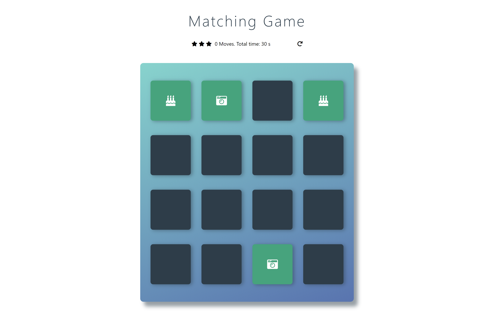
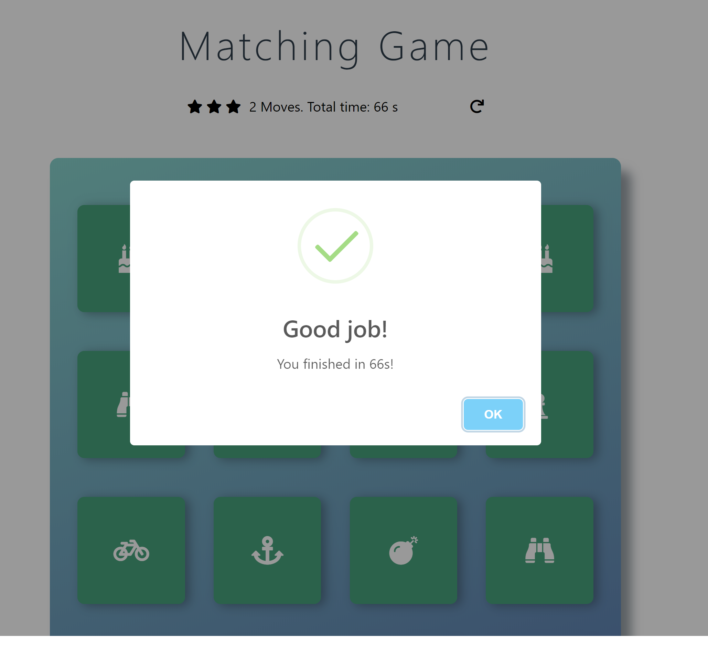

# Memory Game

Memory Game is a classic video game built in JavaScript as a part of Udacity Front-End Web Developer program. 

## Description:
The deck is made of different pairs of cards, each with different symbols on one side. They are arranged randomly on the grid with the symbol face down. Player wins once all cards have successfully been matched. Game contains Congratulations pop-up and star rating that reflects the player's performance.

## Instruction:
1.	Clone or Download repository
2.	Open index.html file to view the project in browser.

## Technologies and Packages:
1.	HTML5
2.	CSS3
3.	JavaScript
4.	jQuery
5.	Bootstrap
6.	SweetAlert

## Screenshot

